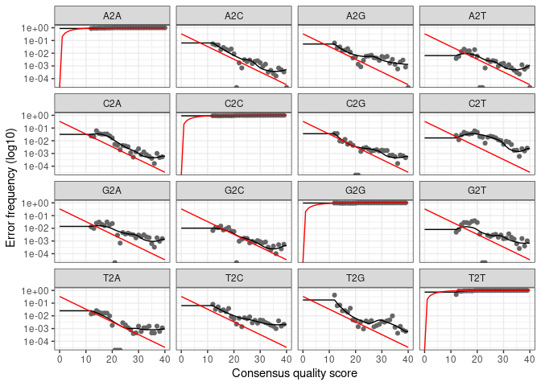

02\_dada2-tuto
================

  - [<span style="color:red">DADA2 tutorial</span>](#dada2-tutorial)
      - [<span style="color:red">Traitement des
        données</span>](#traitement-des-données)
      - [<span style="color:green">plot Q score des reads reverse et
        forward</span>](#plot-q-score-des-reads-reverse-et-forward)
      - [<span style="color:green">Plot du risque d’erreur (échange de
        base)</span>](#plot-du-risque-derreur-échange-de-base)
      - [<span style="color:red">Phylogénie</span>](#phylogénie)
      - [<span style="color:red">Utilisation de
        phyloseq</span>](#utilisation-de-phyloseq)
      - [<span style="color:red">Ordinations</span>](#ordinations)
      - [<span style="color:green">Plot indice
        alpha-diversité</span>](#plot-indice-alpha-diversité)
      - [<span style="color:green">plot bray-curtis basé sur un
        NMDS</span>](#plot-bray-curtis-basé-sur-un-nmds)
      - [<span style="color:green">histogramme
        abondance</span>](#histogramme-abondance)

# <span style="color:red">DADA2 tutorial</span>

## <span style="color:red">Traitement des données</span>

    ## Loading required package: Rcpp

### <span style="color:green">Chemin vers MISeq\_SOP (objet path)</span>

``` r
path <- "~/Loïc/EcoG1/MiSeq_SOP" # CHANGE ME to the directory containing the fastq files after unzipping.
list.files(path)
```

### <span style="color:green">Reads forward dans l’objet fnFs et reverse dans fnRs</span>

``` r
# Forward and reverse fastq filenames have format: SAMPLENAME_R1_001.fastq and SAMPLENAME_R2_001.fastq
fnFs <- sort(list.files(path, pattern="_R1_001.fastq", full.names = TRUE))
fnRs <- sort(list.files(path, pattern="_R2_001.fastq", full.names = TRUE))
# Extract sample names, assuming filenames have format: SAMPLENAME_XXX.fastq
sample.names <- sapply(strsplit(basename(fnFs), "_"), `[`, 1)
```

## <span style="color:green">plot Q score des reads reverse et forward</span>

``` r
plotQualityProfile(fnRs[1:2])
```

<!-- -->

``` r
plotQualityProfile(fnFs[1:2])
```

<!-- -->

<span style="color:blue">Le graphique du score qualité nous montre le Q
score en fonction des nucléotides séquencés.</span>

### <span style="color:green">placer le fichier “filtered” et emplacement des reads filtrés</span>

``` r
filtFs <- file.path(path, "filtered", paste0(sample.names, "_F_filt.fastq.gz"))
filtRs <- file.path(path, "filtered", paste0(sample.names, "_R_filt.fastq.gz"))
names(filtFs) <- sample.names
names(filtRs) <- sample.names
```

### <span style="color:green">filtrage des reads aux paramètres par defaut (truncLen : prend en compte la mauvaise qualité du fin de séquencage)</span>

``` r
out <- filterAndTrim(fnFs, filtFs, fnRs, filtRs, truncLen=c(240,160),
              maxN=0, maxEE=c(2,2), truncQ=2, rm.phix=TRUE,
              compress=TRUE, multithread=TRUE)
head(out)
```

### <span style="color:green">apprentissage des erreurs forward</span>

``` r
errF <- learnErrors(filtFs, multithread=TRUE)
```

### <span style="color:green">apprentissage des erreurs reverse</span>

``` r
errR <- learnErrors(filtRs, multithread=TRUE)
```

## <span style="color:green">Plot du risque d’erreur (échange de base)</span>

``` r
plotErrors(errF, nominalQ=TRUE)
```

    ## Warning: Transformation introduced infinite values in continuous y-axis
    
    ## Warning: Transformation introduced infinite values in continuous y-axis

<!-- -->

### <span style="color:green">soustraire singleton Forward et créer l’objet dadaFs</span>

``` r
dadaFs <- dada(filtFs, err=errF, multithread=TRUE)
```

### <span style="color:green">soustraire singleton reverse et créer l’objet dadaRs</span>

``` r
dadaRs <- dada(filtRs, err=errR, multithread=TRUE)
```

### <span style="color:green">inspecter les objets dadaFs</span>

``` r
dadaFs[[3]]
```

    ## dada-class: object describing DADA2 denoising results
    ## 97 sequence variants were inferred from 1477 input unique sequences.
    ## Key parameters: OMEGA_A = 1e-40, OMEGA_C = 1e-40, BAND_SIZE = 16

### <span style="color:green">Fusionner les reads dans l’objet mergers</span>

``` r
mergers <- mergePairs(dadaFs, filtFs, dadaRs, filtRs, verbose=TRUE)
```

    ## 6540 paired-reads (in 107 unique pairings) successfully merged out of 6891 (in 197 pairings) input.

    ## 5028 paired-reads (in 101 unique pairings) successfully merged out of 5190 (in 157 pairings) input.

    ## 4986 paired-reads (in 81 unique pairings) successfully merged out of 5267 (in 166 pairings) input.

    ## 2595 paired-reads (in 52 unique pairings) successfully merged out of 2754 (in 108 pairings) input.

    ## 2553 paired-reads (in 60 unique pairings) successfully merged out of 2785 (in 119 pairings) input.

    ## 3646 paired-reads (in 55 unique pairings) successfully merged out of 4109 (in 157 pairings) input.

    ## 6079 paired-reads (in 81 unique pairings) successfully merged out of 6514 (in 198 pairings) input.

    ## 3968 paired-reads (in 91 unique pairings) successfully merged out of 4388 (in 187 pairings) input.

    ## 14233 paired-reads (in 143 unique pairings) successfully merged out of 15355 (in 352 pairings) input.

    ## 10528 paired-reads (in 120 unique pairings) successfully merged out of 11165 (in 278 pairings) input.

    ## 11154 paired-reads (in 137 unique pairings) successfully merged out of 11797 (in 298 pairings) input.

    ## 4349 paired-reads (in 85 unique pairings) successfully merged out of 4802 (in 179 pairings) input.

    ## 17431 paired-reads (in 153 unique pairings) successfully merged out of 17812 (in 272 pairings) input.

    ## 5850 paired-reads (in 81 unique pairings) successfully merged out of 6095 (in 159 pairings) input.

    ## 3716 paired-reads (in 86 unique pairings) successfully merged out of 3894 (in 147 pairings) input.

    ## 6865 paired-reads (in 99 unique pairings) successfully merged out of 7191 (in 187 pairings) input.

    ## 4426 paired-reads (in 67 unique pairings) successfully merged out of 4603 (in 127 pairings) input.

    ## 4576 paired-reads (in 101 unique pairings) successfully merged out of 4739 (in 174 pairings) input.

    ## 6092 paired-reads (in 109 unique pairings) successfully merged out of 6315 (in 173 pairings) input.

    ## 4269 paired-reads (in 20 unique pairings) successfully merged out of 4281 (in 28 pairings) input.

``` r
# Inspect the merger data.frame from the first sample
head(mergers[[1]])
```

### <span style="color:green">construction de la table de séquence dans l’objet seqtab</span>

``` r
seqtab <- makeSequenceTable(mergers)
dim(seqtab)
```

### <span style="color:green">Séquences par longueur</span>

``` r
table(nchar(getSequences(seqtab)))
```

### <span style="color:green">supprimer les séquences chimériques</span>

``` r
seqtab.nochim <- removeBimeraDenovo(seqtab, method="consensus", multithread=TRUE, verbose=TRUE)
```

    ## Identified 61 bimeras out of 293 input sequences.

``` r
dim(seqtab.nochim)
```

### <span style="color:green">fréquence de séquences chimériques</span>

``` r
1-sum(seqtab.nochim)/sum(seqtab)
```

    ## [1] 0.03596257

Soit 3,5% de séquences chimériques dans le jeu de donnée

## <span style="color:red">Phylogénie</span>

### <span style="color:green">créer une table track</span>

``` r
getN <- function(x) sum(getUniques(x))
track <- cbind(out, sapply(dadaFs, getN), sapply(dadaRs, getN), sapply(mergers, getN), rowSums(seqtab.nochim))
colnames(track) <- c("input", "filtered", "denoisedF", "denoisedR", "merged", "nonchim")
rownames(track) <- sample.names
head(track)
```

### <span style="color:green">assigner taxon des données dans l’objet taxa</span>

``` r
taxa <- assignTaxonomy(seqtab.nochim, "~/Loïc/EcoG1/silva_nr99_v138_train_set.fa.gz?", multithread=TRUE)
```

### <span style="color:green">Table taxa dans l’objet taxa.print</span>

``` r
taxa.print <- taxa # Removing sequence rownames for display only
rownames(taxa.print) <- NULL
head(taxa.print)
```

### <span style="color:green">assigner les espèces des données importées</span>

``` r
taxa <- addSpecies(taxa, "~/Loïc/EcoG1/RefSeq-RDP_dada2_assignment_species.fa.gz?")
```

### <span style="color:green">assigner les espèces des données importées</span>

``` r
taxa <- addSpecies(taxa, "~/Loïc/EcoG1/silva_species_assignment_v138.fa.gz?")
```

### <span style="color:green">Evaluer l’exactitude</span>

``` r
unqs.mock <- seqtab.nochim["Mock",]
unqs.mock <- sort(unqs.mock[unqs.mock>0], decreasing=TRUE) # Drop ASVs absent in the Mock
cat("DADA2 inferred", length(unqs.mock), "sample sequences present in the Mock community.\n")
```

    ## DADA2 inferred 20 sample sequences present in the Mock community.

### <span style="color:green">communauté de référence</span>

``` r
mock.ref <- getSequences(file.path(path, "HMP_MOCK.v35.fasta"))
match.ref <- sum(sapply(names(unqs.mock), function(x) any(grepl(x, mock.ref))))
```

## <span style="color:red">Utilisation de phyloseq</span>

    ## [1] '1.34.0'

    ## Loading required package: BiocGenerics

    ## Loading required package: parallel

    ## 
    ## Attaching package: 'BiocGenerics'

    ## The following objects are masked from 'package:parallel':
    ## 
    ##     clusterApply, clusterApplyLB, clusterCall, clusterEvalQ,
    ##     clusterExport, clusterMap, parApply, parCapply, parLapply,
    ##     parLapplyLB, parRapply, parSapply, parSapplyLB

    ## The following objects are masked from 'package:stats':
    ## 
    ##     IQR, mad, sd, var, xtabs

    ## The following objects are masked from 'package:base':
    ## 
    ##     anyDuplicated, append, as.data.frame, basename, cbind, colnames,
    ##     dirname, do.call, duplicated, eval, evalq, Filter, Find, get, grep,
    ##     grepl, intersect, is.unsorted, lapply, Map, mapply, match, mget,
    ##     order, paste, pmax, pmax.int, pmin, pmin.int, Position, rank,
    ##     rbind, Reduce, rownames, sapply, setdiff, sort, table, tapply,
    ##     union, unique, unsplit, which.max, which.min

    ## Loading required package: S4Vectors

    ## Loading required package: stats4

    ## 
    ## Attaching package: 'S4Vectors'

    ## The following object is masked from 'package:base':
    ## 
    ##     expand.grid

    ## Loading required package: IRanges

    ## 
    ## Attaching package: 'IRanges'

    ## The following object is masked from 'package:phyloseq':
    ## 
    ##     distance

    ## Loading required package: XVector

    ## 
    ## Attaching package: 'Biostrings'

    ## The following object is masked from 'package:base':
    ## 
    ##     strsplit

### <span style="color:green">creer les objets à partir des données pour les plot</span>

``` r
theme_set(theme_bw())
samples.out <- rownames(seqtab.nochim)
subject <- sapply(strsplit(samples.out, "D"), `[`, 1)
gender <- substr(subject,1,1)
subject <- substr(subject,2,999)
day <- as.integer(sapply(strsplit(samples.out, "D"), `[`, 2))
samdf <- data.frame(Subject=subject, Gender=gender, Day=day)
samdf$When <- "Early"
samdf$When[samdf$Day>100] <- "Late"
rownames(samdf) <- samples.out
```

### <span style="color:green">créer l’objet phyloseq à partir des données dada2</span>

``` r
ps <- phyloseq(otu_table(seqtab.nochim, taxa_are_rows=FALSE),
               sample_data(samdf),
               tax_table(taxa))
ps <- prune_samples(sample_names(ps) != "Mock", ps) # Remove mock sample
```

### <span style="color:green">créer l’objet dna avec les sequences completes puis dans l’objet ps </span>

``` r
dna <- Biostrings::DNAStringSet(taxa_names(ps))
names(dna) <- taxa_names(ps)
ps <- merge_phyloseq(ps, dna)
taxa_names(ps) <- paste0("ASV", seq(ntaxa(ps)))
```

## <span style="color:red">Ordinations</span>

## <span style="color:green">Plot indice alpha-diversité</span>

``` r
plot_richness(ps, x="Day", measures=c("Shannon", "Simpson"), color="When")
```

    ## Warning in estimate_richness(physeq, split = TRUE, measures = measures): The data you have provided does not have
    ## any singletons. This is highly suspicious. Results of richness
    ## estimates (for example) are probably unreliable, or wrong, if you have already
    ## trimmed low-abundance taxa from the data.
    ## 
    ## We recommended that you find the un-trimmed data and retry.

<!-- -->

<span style="color:blue">Ces graphiques montrent la diversité des 19
échantillons (précoces et tardifs) avec les indices de shannon et de
simpson. </span>

### <span style="color:green">Préparer les proportion pour les distances de bray-curtis</span>

``` r
ps.prop <- transform_sample_counts(ps, function(otu) otu/sum(otu))
ord.nmds.bray <- ordinate(ps.prop, method="NMDS", distance="bray")
```

## <span style="color:green">plot bray-curtis basé sur un NMDS</span>

``` r
plot_ordination(ps.prop, ord.nmds.bray, color="When", title="Bray NMDS")
```

<!-- -->

<span style="color:blue">Cette ordination nous montre la dissimilarité
des échantillons tardifs et précoces et met en évidence l’existence de
deux groupes distincts.</span>

## <span style="color:green">histogramme abondance</span>

``` r
top20 <- names(sort(taxa_sums(ps), decreasing=TRUE))[1:20]
ps.top20 <- transform_sample_counts(ps, function(OTU) OTU/sum(OTU))
ps.top20 <- prune_taxa(top20, ps.top20)
plot_bar(ps.top20, x="Day", fill="Family") + facet_wrap(~When, scales="free_x")
```

<!-- -->

<span style="color:blue">Cet histogramme nous montre l’abondance
relative et la composition des communautés bactériennes en fonction des
jours.</span>
